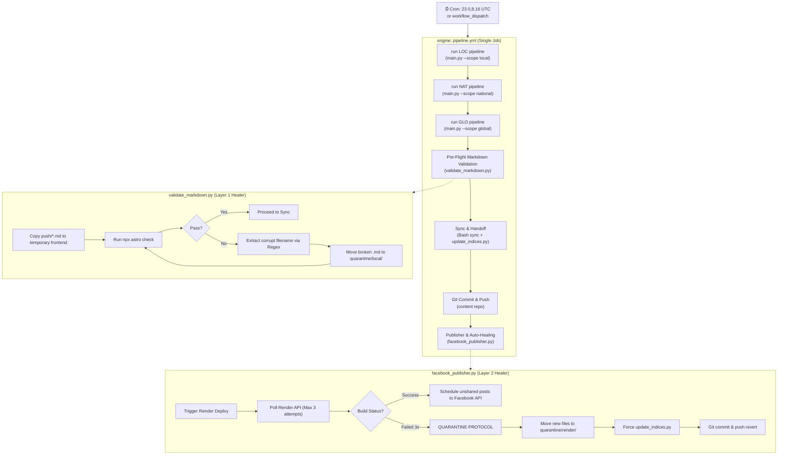
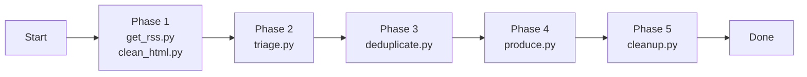

# theHmars Pipeline Architecture

End-to-end architecture of the news curation, deployment, and syndication pipeline.

---

## Repository Map

| Repo | Org | Role |
|---|---|---|
| `engine` | `theHmars` | Pipeline engine + GitHub Actions (unified workflow), scripts, LLM agents |
| `content` | `theHmars` | Markdown articles, history ledgers, quarantine archives (Private) |
| `frontend` | `theHmars` | Astro web portal (deployed to Render) |

---

## Full Orchestration Chain (`pipeline.yml`)

The entire pipeline runs inside a single GitHub Actions workflow (`run-pipeline` job) with sequential steps, tightly enforcing 30-minute processing limits per scope and deploying two distinct layers of self-healing quarantine protocols.



---

## Worker Execution Detail (Inside `main.py`)

Each scope step (`run LOC pipeline`, etc.) sequentially executes the following scripts. A strict 30-minute global threshold is enforced to prevent GitHub Action timeouts.



### Phase-by-Phase Data Flow

| Phase | Script | Reads | Writes |
|---|---|---|---|
| 1a | `get_rss.py` | `data/{scope}/sources.json`, `history/{scope}/sources/*_processed.json` | `tmp/{scope}/discovered_urls.json` |
| 1b | `clean_html.py` | `tmp/{scope}/discovered_urls.json`, `history/{scope}/archive.json` | `tmp/{scope}/cleaned_candidates.json` |
| 2 | `triage.py` | `tmp/{scope}/cleaned_candidates.json` | `tmp/{scope}/chosen_articles.json` |
| 3 | `deduplicate.py` | `tmp/{scope}/chosen_articles.json`, `history/{scope}/covered.json` | `tmp/{scope}/triaged_candidates.json` |
| 4 | `produce.py` | `tmp/{scope}/triaged_candidates.json` | `tmp/{scope}/produced_articles.json`, `history/{scope}/sources/*_processed.json` |
| 5 | `cleanup.py` | `tmp/{scope}/produced_articles.json` | `push/{scope}/*.md`, `history/{scope}/archive.json`, `tmp/{scope}/sync_summary.json` |

---

## Key Path Reference (Persistent States)

### Content Repo (`content/`)
This is the **only** persistent repository. The `engine` workspace is completely ephemeral and destroyed after every run.

```
markdown/{scope}/*.md            # Published articles (source of truth)
quarantine/local/{scope}/*.md    # Articles that failed Astro Pre-Flight check
quarantine/render/*.md           # Articles that crashed the Render build
history/{scope}/
  articles.json                  # Full slug index (auto-generated by update_indices.py)
  covered.json                   # 48h recent articles (for dedup check)
  shared.json                    # FB publisher: already-shared slugs
  pending_shares.json            # FB publisher: overflow queue
  archive.json                   # Leftover candidates recycled for context
  sources/*_processed.json       # URL-level dedup ledger for get_rss.py
```

---

## Self-Healing Architecture Summary

1. **Pre-Flight Filter (`validate_markdown.py`)**: Runs locally on the GitHub runner. Drops the generated Markdown into a temporary `frontend` clone and loops `npx astro check`. Corrupted files are stripped from the batch and placed in `quarantine/local/`.
2. **Render Quarantine Fallback (`facebook_publisher.py`)**: If a file passes local validation but crashes the live Render deployment three times in a row, the pipeline physically removes the offending files from `markdown/`, places them in `quarantine/render/`, forcefully re-indexes `articles.json`, and automatically pushes a git revert to instantly restore the live website to its last known good state.
